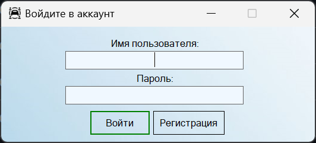

# CarShare Service Simulator

This project is a comprehensive car-sharing service simulator designed as a university course work. It models the services of a car fleet that provides rental vehicles to the public. The application offers different functionalities and access levels for three distinct roles: **client**, **employee**, and **administrator**.

---

## Overview

The **CarShare Service Simulator** is built using **C#** and **Windows Forms** on the **.NET** platform. It demonstrates advanced data modeling and management techniques by integrating multiple database storage approaches (**CSV**, **MongoDB**, and **SQL**) and applying the **"Strategy"** pattern to switch seamlessly between them. This flexibility allows the system to efficiently store, process, and manage a large volume of data while ensuring data integrity and scalability.

The application provides an intuitive user interface that allows users to:
- View and search available vehicles
- Make and manage rental orders
- Access historical data and reports

Employees can manage the servicing of vehicles and process orders, while administrators have full control over the system, including adding, editing, or deleting data and managing the overall service.

---

## Key Features

- **Multi-Role Access:**  
  Three distinct roles (Client, Employee, Administrator) with tailored interfaces and functionalities.
  
- **Flexible Data Management:**  
  Supports three types of databases:
  - **CSV:** For lightweight, flat-file data storage.
  - **MongoDB:** For document-oriented storage of dynamic and hierarchical data.
  - **SQL:** For robust, relational data management with full transactional support.
  
- **Modular Architecture:**  
  Implements the “Strategy” pattern to dynamically choose the appropriate data repository, ensuring high adaptability and ease of maintenance.

- **Intuitive UI:**  
  Developed using Windows Forms, the interface is designed to be simple, user-friendly, and visually appealing. It uses ListView controls for data presentation and supports CRUD operations for all entities.

- **Secure Authentication:**  
  User credentials are stored securely with salted and hashed passwords. The system provides role-based access to protect sensitive operations.

---

## Technologies

- **Programming Language:** C# (.NET Framework)
- **User Interface:** Windows Forms
- **Data Storage:** CSV, MongoDB, SQL
- **Data Access:** LINQ and ADO.NET
- **Architecture Pattern:** Strategy pattern for database repository abstraction
- **Security:** Password salting/hashing and encryption techniques for data protection
- **Development Environment:** Microsoft Visual Studio 2022

---

## User Roles and Credentials

The application supports three user roles. Use the following credentials to log in:

- **Client:**  
  **Login:** User1@gmail.com

- **Employee:**  
  **Login:** Employee2@gmail.com

- **Administrator:**  
  **Login:** Admin3@gmail.com

Each role provides access to different parts of the system:
- **Client:** Can browse available cars, make rental reservations, and view order history.
- **Employee:** Can add or update service records for vehicles, manage orders, and assist clients.
- **Administrator:** Has full control over data management, including creating, editing, deleting records, and system administration.

You can use `appsettings.json` to change settings.

---

## Screenshots

Below are some screenshots demonstrating the user interfaces for different roles:

### Role-specific Interfaces

**Administrator Tab:**

**Employee Tab:**

**User Tab:**

---

## Project Documentation

The project’s detailed requirements, design decisions, and architectural models are documented in the explanatory note (course work) file. This document describes:
- An analysis of the subject area and existing solutions.
- Detailed data modeling for CSV, MongoDB, and SQL databases.
- The use of UML diagrams to define use cases for each role.
- The implementation of the Strategy pattern to achieve flexible data management.

For more detailed information, refer to the explanatory note:
[Documentation.pdf](Documentation.pdf)

---

## Setup & Usage

1. **Compile the Project:**  
   Open the solution in Microsoft Visual Studio 2022 and build the project.

2. **Database Configuration:**  
   Choose the desired data storage type (**CSV**, **MongoDB**, or **SQL**) through the provided configuration form.

3. **Run the Application:**  
   Launch the Windows Forms application. Log in using the credentials provided above based on your role.

4. **Explore Functionality:**  
   - Clients can view available cars and make rental orders.
   - Employees can manage service records and process orders.
   - Administrators can perform full system management tasks.

---

## Contributing

Contributions to improve the application, add features, or fix bugs are welcome. Please fork the repository and submit a pull request with your changes. Ensure that any new code adheres to the existing architectural patterns and is well documented.

---

## License

[MIT License](LICENSE)

---

## Post Scriptum

Enjoy using the **CarShare Service Simulator** and exploring its flexible, multi-database architecture!
